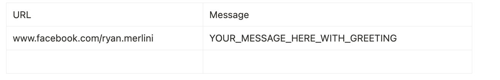

Here's a clear and professional README.md for your Playwright + ExcelJS Facebook messaging automation script:

* * * * *

**Facebook Messaging Automation**

This Node.js script automates sending Facebook messages to users using [Playwright](https://playwright.dev/) for browser automation and [ExcelJS](https://github.com/exceljs/exceljs) to read a list of URLs and messages from an Excel file.

**✨ Features**

-  Logs into Facebook using provided credentials

-  Reads Facebook profile URLs and messages from an Excel file

-  Sends messages to users through Messenger

-  Waits a random number of minutes (5--10) between messages to mimic human behavior

* * * * *

**📁 File Structure**

```
.
├── script.js       # Main automation script
├── input.xlsx      # Excel file with target URLs and messages
└── README.md       # Documentation
```

* * * * *

**📦 Requirements**

-  Node.js v14+

-  A Facebook account with messaging access to the target profiles

Install dependencies:

```
npm install playwright exceljs
```

* * * * *

**📘 Excel Format**

The script expects an Excel file named input.xlsx with the following format (first row is headers):



* * * * *

**▶️ Usage**

```
node script.js <email> <password> [excelFilePath]
```

-  email: Your Facebook email address

-  password: Your Facebook password

-  excelFilePath *(optional)*: Path to the Excel file (defaults to input.xlsx)

Example:

```
node script.js example@gmail.com myPassword123 input.xlsx
```

* * * * *

**⚙️ How It Works**

1.  Launches a visible Chromium browser

2.  Logs in to Facebook

3.  Iterates over each row in the Excel file:

-  Opens the Facebook profile link

-  Clicks "Message"

-  Sends the provided message

-  Waits 5--10 minutes randomly before continuing

* * * * *

**⚠️ Disclaimers**

-  This script is for **educational and personal use only**.

-  Automating interactions on platforms like Facebook may violate their [Terms of Service](https://www.facebook.com/legal/terms). Use responsibly.

* * * * *

**🧼 Troubleshooting**

-  Ensure you're using correct and active Facebook credentials

-  Disable 2FA on the account, or handle it via additional automation

-  If selectors change (Facebook often updates them), you may need to update the SELECTORS object

* * * * *

Let me know if you'd like a version that runs in headless mode or adds retry logic!